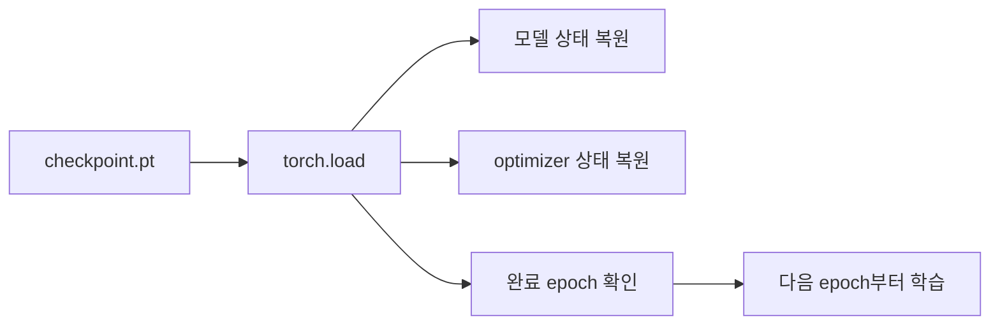

## 1. 이번에 우리가 배울 것

새 런타임에서도 독립 실행할 수 있도록 실제 2 epoch checkpoint를 페이지 안에서 먼저 만든 뒤,<br> 
저장한 다음 epoch부터 학습을 이어가는 흐름을 배운다

## 2. 모델 불러오기와 학습 재개의 차이

| 목적 | 필요한 상태 | 사용 예시 |
| --- | --- | --- |
| 추론 또는 평가 | 모델 상태 | `model_state_dict` |
| 학습 재개 | 모델 상태, optimizer 상태, 완료 epoch | `model_state_dict`, `optimizer_state_dict`, `completed_epochs` |

모델 상태만 불러오면 예측은 할 수 있다. <br>
그러나 optimizer가 학습 중 쌓아온 내부 상태는 복원되지 않으므로, **이어서 학습하려면 optimizer 상태도 함께 불러와야 합니다.**

## 3. 학습 재개 흐름


```
flowchart LR
    A["checkpoint.pt"] --> B["torch.load"]
    B --> C["모델 상태 복원"]
    B --> D["optimizer 상태 복원"]
    B --> E["완료 epoch 확인"]
    E --> F["다음 epoch부터 학습"]
```


순서는 다음과 같습니다.

1. 저장할 때와 같은 구조의 모델과 optimizer를 만듭니다.
2. checkpoint를 불러옵니다.
3. 모델과 optimizer 상태를 복원합니다.
4. 정확한 epoch 경계 재개가 필요하면 RNG와 실제 train DataLoader에 연결된 generator 상태를 복원합니다.
5. 다음 DataLoader iterator를 만들기 전에 모든 상태 복원을 끝냅니다.
6. `completed_epochs + 1`을 시작 epoch로 사용

## 4. 독립 실행 준비: 2 epoch checkpoint 만들기

먼저 필요한 라이브러리와 재현성 함수를 준비

```python
from pathlib import Path
import random

import numpy as np
import torch
import torch.nn as nn
from torch.utils.data import DataLoader, TensorDataset, random_split

SEED = 42

def set_seed(seed=42):
    random.seed(seed)
    np.random.seed(seed)
    torch.manual_seed(seed)
    if torch.cuda.is_available():
        torch.cuda.manual_seed_all(seed)

def capture_rng_state():
    """weights_only=True로 읽을 수 있는 기본 자료형과 Tensor로 RNG 상태를 저장합니다."""
    numpy_state = np.random.get_state()
    return {
        "python": random.getstate(),
        "numpy": {
            "bit_generator": numpy_state[0],
            "state": numpy_state[1].tolist(),
            "pos": int(numpy_state[2]),
            "has_gauss": int(numpy_state[3]),
            "cached_gaussian": float(numpy_state[4]),
        },
        "torch_cpu": torch.get_rng_state(),
        "torch_cuda": (
            torch.cuda.get_rng_state_all()
            if torch.cuda.is_available()
            else None
        ),
    }

def restore_rng_state(rng_state):
    """checkpoint에 저장된 Python, NumPy, PyTorch RNG 상태를 복원합니다."""
    random.setstate(rng_state["python"])

    numpy_state = rng_state["numpy"]
    np.random.set_state((
        numpy_state["bit_generator"],
        np.asarray(numpy_state["state"], dtype=np.uint32),
        int(numpy_state["pos"]),
        int(numpy_state["has_gauss"]),
        float(numpy_state["cached_gaussian"]),
    ))

    torch.set_rng_state(rng_state["torch_cpu"].cpu())
    if torch.cuda.is_available() and rng_state["torch_cuda"] is not None:
        torch.cuda.set_rng_state_all([
            state.cpu() for state in rng_state["torch_cuda"]
        ])

set_seed(SEED)
device = torch.device("cuda" if torch.cuda.is_available() else "cpu")
print("device:", device)
```

간단한 분류 데이터와 DataLoader를 만든다.<br>
정확한 epoch 경계 재개를 위해 train DataLoader에 전달한 generator 객체를 따로 관리

```python
num_samples = 240
X = torch.randn(num_samples, 4)
true_W = torch.tensor([
    [1.0, -1.0, 0.5],
    [0.5, 1.5, -1.0],
    [-1.0, 0.5, 1.0],
    [1.0, 0.2, -0.5],
])
y = (X @ true_W).argmax(dim=1)

dataset = TensorDataset(X, y)
split_generator = torch.Generator().manual_seed(SEED)
train_dataset, valid_dataset = random_split(
    dataset,
    [192, 48],
    generator=split_generator,
)

loader_generator = torch.Generator().manual_seed(SEED)
train_loader = DataLoader(
    train_dataset,
    batch_size=16,
    shuffle=True,
    generator=loader_generator,
    num_workers=0,
)
valid_loader = DataLoader(
    valid_dataset,
    batch_size=48,
    shuffle=False,
    num_workers=0,
)
```

모델과 학습·검증 함수를 정의

```python
class SimpleMLP(nn.Module):
    def __init__(self, input_dim=4, hidden_dim=32, num_classes=3):
        super().__init__()
        self.fc1 = nn.Linear(input_dim, hidden_dim)
        self.relu = nn.ReLU()
        self.fc2 = nn.Linear(hidden_dim, num_classes)

    def forward(self, x):
        x = self.fc1(x)
        x = self.relu(x)
        return self.fc2(x)

def train_one_epoch(model, train_loader, criterion, optimizer, device):
    model.train()
    total_loss = 0.0
    total_correct = 0
    total_samples = 0

    for inputs, labels in train_loader:
        inputs = inputs.to(device)
        labels = labels.to(device)

        optimizer.zero_grad()
        logits = model(inputs)
        loss = criterion(logits, labels)
        loss.backward()
        optimizer.step()

        batch_size = labels.size(0)
        total_loss += loss.item() * batch_size
        total_correct += (logits.argmax(dim=1) == labels).sum().item()
        total_samples += batch_size

    return total_loss / total_samples, total_correct / total_samples

def validate(model, valid_loader, criterion, device):
    model.eval()
    total_loss = 0.0
    total_correct = 0
    total_samples = 0

    with torch.no_grad():
        for inputs, labels in valid_loader:
            inputs = inputs.to(device)
            labels = labels.to(device)

            logits = model(inputs)
            loss = criterion(logits, labels)

            batch_size = labels.size(0)
            total_loss += loss.item() * batch_size
            total_correct += (logits.argmax(dim=1) == labels).sum().item()
            total_samples += batch_size

    return total_loss / total_samples, total_correct / total_samples
```

checkpoint 저장 함수는 history 길이와 완료 epoch 수가 같은지 확인하고, 임시 파일을 거쳐 저장합니다.

```python
def save_checkpoint(
    model,
    optimizer,
    completed_epochs,
    history,
    config,
    loader_generator,
    path,
):
    if any(len(values) != completed_epochs for values in history.values()):
        raise ValueError("모든 history 길이는 completed_epochs와 같아야 합니다.")

    checkpoint = {
        "completed_epochs": int(completed_epochs),
        "model_state_dict": model.state_dict(),
        "optimizer_state_dict": optimizer.state_dict(),
        "best_valid_loss": float(min(history["valid_loss"])),
        "history": history,
        "config": config,
        "rng_state": capture_rng_state(),
        "loader_generator_state": loader_generator.get_state(),
        "early_stopping_state_dict": None,
    }

    path = Path(path)
    path.parent.mkdir(parents=True, exist_ok=True)
    temporary_path = path.with_suffix(path.suffix + ".tmp")
    torch.save(checkpoint, temporary_path)
    temporary_path.replace(path)

config = {
    "model_name": "SimpleMLP",
    "input_dim": 4,
    "hidden_dim": 32,
    "num_classes": 3,
    "learning_rate": 0.001,
    "batch_size": 16,
    "seed": SEED,
}

model = SimpleMLP(
    input_dim=config["input_dim"],
    hidden_dim=config["hidden_dim"],
    num_classes=config["num_classes"],
).to(device)
criterion = nn.CrossEntropyLoss()
optimizer = torch.optim.Adam(
    model.parameters(),
    lr=config["learning_rate"],
)
history = {
    "train_loss": [],
    "train_acc": [],
    "valid_loss": [],
    "valid_acc": [],
}

for epoch in range(1, 3):
    train_loss, train_acc = train_one_epoch(
        model, train_loader, criterion, optimizer, device
    )
    valid_loss, valid_acc = validate(
        model, valid_loader, criterion, device
    )

    history["train_loss"].append(train_loss)
    history["train_acc"].append(train_acc)
    history["valid_loss"].append(valid_loss)
    history["valid_acc"].append(valid_acc)

    print(
        f"epoch={epoch} | "
        f"train_loss={train_loss:.4f} | "
        f"train_acc={train_acc:.4f} | "
        f"valid_loss={valid_loss:.4f} | "
        f"valid_acc={valid_acc:.4f}"
    )

checkpoint_path = Path("runs/resume_demo/last.pt")
save_checkpoint(
    model=model,
    optimizer=optimizer,
    completed_epochs=2,
    history=history,
    config=config,
    loader_generator=loader_generator,
    path=checkpoint_path,
)
print("2 epoch checkpoint 저장:", checkpoint_path)
```

## 5. checkpoint 불러오기

새 런타임에서 복원하는 상황처럼 모델, optimizer와 train DataLoader용 generator를 새로 만든다. DataLoader iterator는 아직 만들지 않는다

```python
resumed_model = SimpleMLP(
    input_dim=config["input_dim"],
    hidden_dim=config["hidden_dim"],
    num_classes=config["num_classes"],
).to(device)
resumed_optimizer = torch.optim.Adam(
    resumed_model.parameters(),
    lr=config["learning_rate"],
)

resumed_loader_generator = torch.Generator()
resumed_train_loader = DataLoader(
    train_dataset,
    batch_size=config["batch_size"],
    shuffle=True,
    generator=resumed_loader_generator,
    num_workers=0,
)

checkpoint = torch.load(
    checkpoint_path,
    map_location=device,
    weights_only=True,
)
print(checkpoint.keys())
```

`map_location=device`를 사용하면 저장 장치와 현재 실행 장치가 달라도 checkpoint Tensor를 현재 장치로 불러올 수 있다

## 6. 모델·optimizer·재현성 상태 복원하기

모델과 optimizer를 먼저 복원한 뒤, 다음 DataLoader iterator를 만들기 전에 RNG와 generator 상태를 복원한다

```python
if checkpoint["config"] != config:
    raise ValueError("checkpoint config가 현재 설정과 다릅니다.")

resumed_model.load_state_dict(checkpoint["model_state_dict"])
resumed_optimizer.load_state_dict(checkpoint["optimizer_state_dict"])

restore_rng_state(checkpoint["rng_state"])
resumed_loader_generator.set_state(
    checkpoint["loader_generator_state"].cpu()
)

completed_epochs = int(checkpoint["completed_epochs"])
start_epoch = completed_epochs + 1
history = checkpoint["history"]

if any(len(values) != completed_epochs for values in history.values()):
    raise ValueError("checkpoint history 길이가 completed_epochs와 다릅니다.")

model = resumed_model
optimizer = resumed_optimizer
train_loader = resumed_train_loader

print("완료된 epoch:", completed_epochs)
print("다시 시작할 epoch:", start_epoch)
```

```
완료된 epoch: 2
다시 시작할 epoch: 3
```

## 7. 3 epoch부터 학습 재개

총 5 epoch까지 학습을 이어가고, 매 epoch가 끝날 때 같은 checkpoint를 갱신합니다.

```python
total_epochs = 5

for epoch in range(start_epoch, total_epochs + 1):
    train_loss, train_acc = train_one_epoch(
        model,
        train_loader,
        criterion,
        optimizer,
        device,
    )
    valid_loss, valid_acc = validate(
        model,
        valid_loader,
        criterion,
        device,
    )

    history["train_loss"].append(train_loss)
    history["train_acc"].append(train_acc)
    history["valid_loss"].append(valid_loss)
    history["valid_acc"].append(valid_acc)

    save_checkpoint(
        model=model,
        optimizer=optimizer,
        completed_epochs=epoch,
        history=history,
        config=config,
        loader_generator=resumed_loader_generator,
        path=checkpoint_path,
    )

    print(
        f"epoch={epoch} | "
        f"train_loss={train_loss:.4f} | "
        f"train_acc={train_acc:.4f} | "
        f"valid_loss={valid_loss:.4f} | "
        f"valid_acc={valid_acc:.4f}"
    )
```

## 8. 저장 결과 검증하기

checkpoint를 다시 읽어 완료 epoch와 history 길이를 확인

```python
verified = torch.load(
    checkpoint_path,
    map_location="cpu",
    weights_only=True,
)

assert int(verified["completed_epochs"]) == 5
assert all(len(values) == 5 for values in verified["history"].values())

print("최종 완료 epoch:", verified["completed_epochs"])
print("history 길이:", {
    key: len(values)
    for key, values in verified["history"].items()
})
```

출력

```
최종 완료 epoch: 5
history 길이: {'train_loss': 5, 'train_acc': 5, 'valid_loss': 5, 'valid_acc': 5}
```

## 9. 평가나 추론만 할 때

평가·추론에서는 optimizer가 필요하지 않는다. 같은 구조의 모델을 만든 뒤 model 상태만 복원하고 `eval()`과 `inference_mode()`를 사용한다

```python
inference_model = SimpleMLP(
    input_dim=config["input_dim"],
    hidden_dim=config["hidden_dim"],
    num_classes=config["num_classes"],
).to(device)

inference_checkpoint = torch.load(
    checkpoint_path,
    map_location=device,
    weights_only=True,
)
inference_model.load_state_dict(
    inference_checkpoint["model_state_dict"]
)
inference_model.eval()

with torch.inference_mode():
    sample_logits = inference_model(X[:5].to(device))
    sample_predictions = sample_logits.argmax(dim=1)

print("예측 class:", sample_predictions.cpu())
```

## 10. 자주 발생하는 실수

| 실수 | 결과 | 해결 방법 |
| --- | --- | --- |
| 다른 모델 구조를 생성함 | parameter key 또는 shape 오류 | checkpoint config와 같은 구조로 생성 |
| optimizer 상태를 불러오지 않음 | Adam 내부 상태가 사라짐 | 학습 재개 시 optimizer도 복원 |
| history key나 길이가 다름 | `KeyError` 또는 기록 불일치 | 네 metric key와 epoch 길이를 저장 전에 검사 |
| 새 generator를 seed만 다시 지정함 | 중단 시점의 다음 shuffle과 달라짐 | 같은 generator 상태를 iterator 생성 전에 복원 |
| `start_epoch=completed_epochs`로 설정함 | 마지막 epoch를 다시 실행함 | `completed_epochs + 1` 사용 |
| 평가 시 `model.eval()`만 호출함 | gradient 추적은 계속 활성화됨 | `inference_mode()` 또는 `no_grad()`도 함께 사용 |