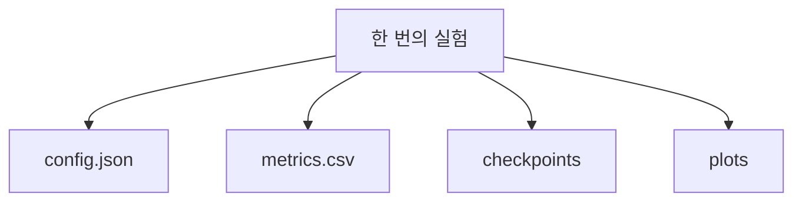

## 1. 이번에 우리가 배울 것

- seed를 고정하여 실험 조건을 최대한 재현한다
- config와 epoch metric을 파일로 기록한다
- checkpoint를 저장하고 불러온다

이 파일들을 **한 번의 실험을 나타내는 하나의 폴더**에 모아 관리한다.

## 2. 왜 실험마다 폴더를 나누나요?

결과 파일을 같은 위치에 계속 저장하면 문제가 발생한다

```
config.json
metrics.csv
checkpoint.pt
loss_curve.png
```

새로운 실험을 실행할 때 기존 파일이 덮어써질 수 있고, 어떤 파일들이 같은 실험에서 나온 것인지 구분하기도 어렵다

따라서 실험마다 별도의 폴더를 만든다



## 3. 기본 실험 폴더 구조

```
runs/
└── 20260826_153012_123456_mlp_baseline/
    ├── config.json
    ├── metrics.csv
    ├── checkpoints/
    │   ├── last.pt
    │   └── best.pt
    └── plots/
        └── loss_curve.png
```

| 파일 또는 폴더 | 역할 |
| --- | --- |
| `config.json` | 모델 구조, learning rate, batch size, seed 등의 실험 설정 |
| `metrics.csv` | epoch별 train/validation loss와 accuracy |
| `checkpoints/last.pt` | 마지막으로 완료된 epoch의 학습 상태 |
| `checkpoints/best.pt` | validation 성능이 가장 좋았던 모델 상태 |
| `plots/loss_curve.png` | 학습 곡선을 이미지로 저장한 파일 |

`last.pt`는 주로 학습 재개에 사용하고, `best.pt`는 가장 성능이 좋았던 모델을 평가하거나 추론할 때 사용한다

## 4. 새로운 run directory 만들기

새 Colab 런타임에서도 실행할 수 있도록 작은 3 epoch 실험을 직접 수행하고, 그 결과를 하나의 run directory에 저장한다

현재 시각과 실험 이름을 합쳐 서로 다른 폴더를 만듭니다. microsecond까지 포함하므로 셀을 빠르게 다시 실행해도 경로가 충돌할 가능성이 작다.

```python
from datetime import datetime
from pathlib import Path

def create_run_dir(experiment_name, root="runs"):
    timestamp = datetime.now().strftime("%Y%m%d_%H%M%S_%f")
    run_dir = Path(root) / f"{timestamp}_{experiment_name}"

    (run_dir / "checkpoints").mkdir(parents=True, exist_ok=False)
    (run_dir / "plots").mkdir()

    return run_dir

run_dir = create_run_dir("mlp_baseline")
print("실험 폴더:", run_dir)
```

예상 출력의 시각 부분은 실행할 때마다 달라진다

```
실험 폴더: runs/20260826_153012_123456_mlp_baseline
```

## 5. config.json 저장하기

config에는 이번 실험을 다시 설명하는 데 필요한 모델·데이터·학습 설정을 저장한다

```python
import json

config = {
    "model_name": "SimpleMLP",
    "num_samples": 600,
    "input_dim": 4,
    "hidden_dim": 32,
    "num_classes": 3,
    "learning_rate": 0.01,
    "batch_size": 32,
    "epochs": 3,
    "seed": 42,
    "device": "cpu",
}

config_path = run_dir / "config.json"

with open(config_path, "w", encoding="utf-8") as file:
    json.dump(config, file, ensure_ascii=False, indent=2)

print("config 저장:", config_path)
```

## 6. 실제 3 epoch 미니 실험 준비하기

외부 데이터를 다운로드하지 않고 synthetic 분류 데이터와 작은 MLP를 사용

```python
import torch
import torch.nn as nn
from torch.utils.data import DataLoader, TensorDataset, random_split

torch.manual_seed(config["seed"])

X = torch.randn(config["num_samples"], config["input_dim"])
true_W = torch.tensor([
    [1.0, -1.0, 0.5],
    [0.5, 1.5, -1.0],
    [-1.0, 0.5, 1.0],
    [1.0, 0.2, -0.5],
])
y = (X @ true_W).argmax(dim=1)

dataset = TensorDataset(X, y)
train_size = int(len(dataset) * 0.8)
valid_size = len(dataset) - train_size

split_generator = torch.Generator().manual_seed(config["seed"])
train_dataset, valid_dataset = random_split(
    dataset,
    [train_size, valid_size],
    generator=split_generator,
)

loader_generator = torch.Generator().manual_seed(config["seed"])
train_loader = DataLoader(
    train_dataset,
    batch_size=config["batch_size"],
    shuffle=True,
    generator=loader_generator,
    num_workers=0,
)
valid_loader = DataLoader(
    valid_dataset,
    batch_size=config["batch_size"],
    shuffle=False,
    num_workers=0,
)
```

모델과 학습·검증 함수를 정의

```python
class SimpleMLP(nn.Module):
    def __init__(self, input_dim=4, hidden_dim=32, num_classes=3):
        super().__init__()
        self.fc1 = nn.Linear(input_dim, hidden_dim)
        self.relu = nn.ReLU()
        self.fc2 = nn.Linear(hidden_dim, num_classes)

    def forward(self, x):
        x = self.fc1(x)
        x = self.relu(x)
        return self.fc2(x)

def count_correct(logits, labels):
    predictions = logits.argmax(dim=1)
    return (predictions == labels).sum().item()

def train_one_epoch(model, data_loader, criterion, optimizer, device):
    model.train()
    total_loss = 0.0
    total_correct = 0
    total_samples = 0

    for inputs, labels in data_loader:
        inputs = inputs.to(device)
        labels = labels.to(device)

        optimizer.zero_grad()
        logits = model(inputs)
        loss = criterion(logits, labels)
        loss.backward()
        optimizer.step()

        batch_size = labels.size(0)
        total_loss += loss.item() * batch_size
        total_correct += count_correct(logits, labels)
        total_samples += batch_size

    if total_samples == 0:
        raise ValueError("train DataLoader가 비어 있습니다.")

    return total_loss / total_samples, total_correct / total_samples

def validate(model, data_loader, criterion, device):
    model.eval()
    total_loss = 0.0
    total_correct = 0
    total_samples = 0

    with torch.no_grad():
        for inputs, labels in data_loader:
            inputs = inputs.to(device)
            labels = labels.to(device)

            logits = model(inputs)
            loss = criterion(logits, labels)

            batch_size = labels.size(0)
            total_loss += loss.item() * batch_size
            total_correct += count_correct(logits, labels)
            total_samples += batch_size

    if total_samples == 0:
        raise ValueError("validation DataLoader가 비어 있습니다.")

    return total_loss / total_samples, total_correct / total_samples

device = torch.device(config["device"])
model = SimpleMLP(
    input_dim=config["input_dim"],
    hidden_dim=config["hidden_dim"],
    num_classes=config["num_classes"],
).to(device)
criterion = nn.CrossEntropyLoss()
optimizer = torch.optim.Adam(
    model.parameters(),
    lr=config["learning_rate"],
)
```

## 7. metrics와 checkpoint를 함께 저장하기실제 3 epoch를 학습하면서 `metrics.csv`를 기록합니다. `last.pt`는 매 epoch 갱신하고, `best.pt`는 validation loss가 개선되었을 때만 갱신합니다.

```python
import csv

def save_checkpoint(checkpoint, path):
    path = Path(path)
    temporary_path = path.with_suffix(path.suffix + ".tmp")
    torch.save(checkpoint, temporary_path)
    temporary_path.replace(path)

history = {
    "train_loss": [],
    "train_acc": [],
    "valid_loss": [],
    "valid_acc": [],
}
best_valid_loss = float("inf")
best_epoch = 0

metrics_path = run_dir / "metrics.csv"
last_path = run_dir / "checkpoints" / "last.pt"
best_path = run_dir / "checkpoints" / "best.pt"

with open(metrics_path, "w", newline="", encoding="utf-8") as file:
    writer = csv.writer(file)
    writer.writerow([
        "epoch",
        "train_loss",
        "train_acc",
        "valid_loss",
        "valid_acc",
    ])

    for epoch in range(1, config["epochs"] + 1):
        train_loss, train_acc = train_one_epoch(
            model, train_loader, criterion, optimizer, device
        )
        valid_loss, valid_acc = validate(
            model, valid_loader, criterion, device
        )

        history["train_loss"].append(train_loss)
        history["train_acc"].append(train_acc)
        history["valid_loss"].append(valid_loss)
        history["valid_acc"].append(valid_acc)

        writer.writerow([
            epoch,
            train_loss,
            train_acc,
            valid_loss,
            valid_acc,
        ])
        file.flush()

        is_best = valid_loss < best_valid_loss
        if is_best:
            best_valid_loss = valid_loss
            best_epoch = epoch

        checkpoint = {
            "completed_epochs": epoch,
            "model_state_dict": model.state_dict(),
            "optimizer_state_dict": optimizer.state_dict(),
            "best_valid_loss": best_valid_loss,
            "best_epoch": best_epoch,
            "history": {
                key: values.copy()
                for key, values in history.items()
            },
            "config": config,
        }

        save_checkpoint(checkpoint, last_path)
        if is_best:
            save_checkpoint(checkpoint, best_path)

        print(
            f"epoch={epoch} | "
            f"train_loss={train_loss:.4f} | "
            f"train_acc={train_acc:.4f} | "
            f"valid_loss={valid_loss:.4f} | "
            f"valid_acc={valid_acc:.4f}"
        )

print()
print(metrics_path.read_text(encoding="utf-8"))
```

`last.pt`의 `completed_epochs`는 마지막 완료 epoch이고,<br>
`best.pt`의 `completed_epochs`는 validation loss가 가장 좋았던 저장 시점이다. 두 파일은 같은 key 구조를 사용

저장된 두 checkpoint를 다시 읽어 구조를 확인합니다.

```python
last_checkpoint = torch.load(
    last_path,
    map_location="cpu",
    weights_only=True,
)
best_checkpoint = torch.load(
    best_path,
    map_location="cpu",
    weights_only=True,
)

assert last_checkpoint.keys() == best_checkpoint.keys()
assert int(last_checkpoint["completed_epochs"]) == config["epochs"]
assert int(best_checkpoint["completed_epochs"]) == int(
    last_checkpoint["best_epoch"]
)
assert all(
    len(values) == config["epochs"]
    for values in last_checkpoint["history"].values()
)

print("last 완료 epoch:", last_checkpoint["completed_epochs"])
print("best 저장 epoch:", best_checkpoint["completed_epochs"])
print("전체 실험의 best epoch:", last_checkpoint["best_epoch"])
```


## 8. 실제 history로 학습 곡선 저장하기

하드코딩한 숫자가 아니라 방금 학습한 history의 loss를 사용

```python
import matplotlib.pyplot as plt

epochs = range(1, len(history["train_loss"]) + 1)

plt.figure(figsize=(6, 4))
plt.plot(
    epochs,
    history["train_loss"],
    marker="o",
    label="train_loss",
)
plt.plot(
    epochs,
    history["valid_loss"],
    marker="o",
    label="valid_loss",
)
plt.xlabel("epoch")
plt.ylabel("loss")
plt.xticks(list(epochs))
plt.legend()
plt.tight_layout()

plot_path = run_dir / "plots" / "loss_curve.png"
plt.savefig(plot_path, dpi=150)
plt.show()
plt.close()

print("plot 저장:", plot_path)
```

## 9. 생성된 파일 확인하기

`rglob()`으로 run directory 아래의 결과물을 상대 경로로 확인

```python
for path in sorted(run_dir.rglob("*")):
    relative_path = path.relative_to(run_dir).as_posix()
    suffix = "/" if path.is_dir() else ""
    print(relative_path + suffix)
```

예상되는 구조는 다음과 같습니다.

```
checkpoints/
checkpoints/best.pt
checkpoints/last.pt
config.json
metrics.csv
plots/
plots/loss_curve.png
```


실무에서는 어떤 정보까지 더 저장하나요?

- 데이터셋 이름과 버전
- train/valid/test split 정보
- Python과 PyTorch 버전
- Git commit ID
- 최종 결과를 요약한 `summary.json`
- 여러 seed로 반복한 실험 결과
- RNG 상태와 DataLoader generator 상태