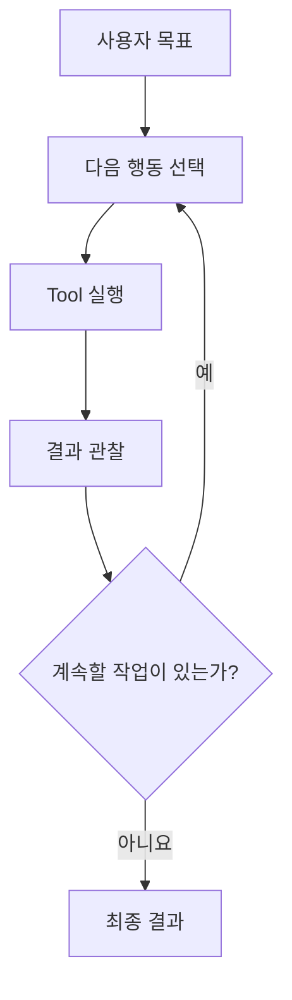

# 딥러닝에서 이어 보기

LLM은 딥러닝 모델의 한 종류다
 
Agent와 Harness는 새로운 모델 종류가 아니다

Agent와 Harness는 모델과 외부 기능(Tool) 및 실행 로직을 묶어 실제 작업을 수행하게 하는 시스템 수준의 개념이다

| 구분 | 무엇을 하나요? | 지금 기억할 점 |
| --- | --- | --- |
| 딥러닝 모델 | 학습된 매개변수로 입력을 처리해 예측/표현/생성 등의 출력을 만든다. | 모델의 출력 자체가 외부 시스템의 행동은 아니다. |
| LLM | 입력 문맥을 바탕으로 텍스트나 정해진 형식의 응답을 생성한다. | 설명이나 Tool 호출 형식을 만들 수 있지만 직접 서버를 바꾸지는 않습니다. |
| Agent | 목표를 보고 Tool을 선택하고 결과를 관찰하며 다음 행동을 정한다. | 모델의 제안이 프로그램을 통해 실제 행동으로 이어질 수 있다. |
| Harness | Agent 주변에서 권한/승인/상태/검증/복구를 관리한다 | 모델을 다시 학습시키는 기법이 아니라 실행 시스템을 설계하는 영역이다. |

Harness Engineering은 모델을 포함한 Agent 시스템이 실제 작업을 수행할 때 목표/판단에 필요한 정보(Context)/권한/Tool 실행/검증/복구를 설계하는 영역이다.

## 용어

| 용어 | 이 자료에서의 뜻 |
| --- | --- |
| 운영 환경(Production) | 실제 사용자가 이용하는 시스템입니다. |
| 지표(Metric) | 응답 시간/오류율처럼 시스템 상태를 숫자로 보여주는 값입니다. |
| 로그(Log) | 시스템에서 일어난 사건을 시간 순서로 남긴 기록입니다. |
| 상태 확인(Health Check) | 서비스가 정상적으로 응답하는지 확인하는 검사입니다. |
| 롤백(Rollback) | 문제가 생긴 변경을 이전 상태로 되돌리는 절차입니다. |
| 실행 절차서(Runbook) | 장애나 반복 업무의 대응 순서를 적은 문서입니다. |
| 도구(Tool) | Agent가 계산/검색/조회/파일 처리/외부 시스템 변경처럼 모델의 출력 생성만으로 수행할 수 없는 기능을 사용하도록, 실행 프로그램이 정해진 입력 형식으로 호출하는 인터페이스입니다. |

## 1. 먼저 알아야 할 배경지식

### LLM은 무엇을 하나

LLM(Large Language Model)은 입력 문맥을 바탕으로 텍스트를 생성하며,  정해진 형식으로 Tool 사용 요청을 만들 수도 있다. 
모델에 따라 텍스트뿐 아니라 구조화된 출력이나 다른 형태의 입력/출력도 다룰 수 있다.

모델이 Tool 호출 형식을 생성하는 것과 프로그램이 실제 행동을 실행하는 것은 다르다

파일 수정, 서버 재시작, 결제처럼 외부 상태를 바꾸는 행동은 모델이 아니라 실행 프로그램이 Tool을 호출할 때 발생

**Tool Calling 은 무엇인가요?**

Tool Calling은 모델이 정해진 함수나 외부 API를 선택하고, 프로그램이 그 요청을 실행하는 방식이다

1. 프로그램이 사용할 수 있는 Tool과 입력 형식(Schema)을 모델에게 알려줍니다.
2. 모델이 사용할 Tool과 입력값을 제안한다
3. 프로그램이 입력 형식을 확인한다
4. 프로그램이 Tool을 실행한다
5. 실행 결과를 모델에게 전달한다.

이 최소 흐름만으로 사람 승인, 세밀한 권한 정책, 상태 저장, 외부 완료 검증과 복구가 자동으로 생기지는 않는다.

### Agent는 무엇인가

이 자료에서 Agent는 목표를 위해 Tool을 선택하고, 실행 결과를 관찰하며, 필요하면 다음 행동을 반복할 수 있는 시스템을 뜻한다

## 2. 기본 모델, Tool을 사용하는 Agent, 운영용 Harness를 갖춘 Agent

| 단계 | 추가되는 능력 | 운영 관점 |
| --- | --- | --- |
| 기본 모델 | 입력 문맥을 바탕으로 출력을 생성한다 | 외부 상태 변경은 별도 실행 프로그램이 있어야 발생한다 |
| Tool을 사용하는 Agent | Tool을 선택하고 결과를 관찰하며 다음 행동을 정한다. | 최소한의 실행 Loop가 있지만 권한/복구/검증 수준은 구현에 따라 크게 다르다. |
| 운영용 Harness를 갖춘 Agent | 정책, 승인, 상태, 외부 검증, 복구, 평가와 추적을 포함한다. | 위험을 제한하고 성공/실패를 재현 가능하게 판단한다. |

같은 모델이라도 문서, Tool, 권한, 완료 기준, 복구 흐름에 따라 Agent의 실제 성공률이 달라진다.

## 3. Prompt와 Tool만 연결하면 왜 부족할까요?

다음 상황을 예시로 들면

> 수강생용 Private LLM API는 평소 1초 안에 응답했지만 현재는 약 4초가 걸린다.  Agent는 범위가 제한된 지표/로그 조회 Tool과 서버 재시작 Tool에 접근할 수 있다.  재시작은 모든 수강생에게 영향을 줄 수 있어 정책상 사람 승인 후에만 실행되어야 하지만,  단순한 Prompt/Tool 연결 자체가 그 승인을 강제한다고 가정하지 않습니다
>
Prompt와 Tool만 연결한 Agent는 다음과 같은 실수를 할 수 있다

- 지표나 로그를 확인하기 전에 원인을 추측합니다.
- 읽기 작업이라는 이유만으로 민감한 로그를 과도하게 조회합니다.
- 잘못된 입력값으로 Tool을 호출합니다.
- 같은 실패를 제한 없이 반복합니다.
- 오래된 Runbook이나 Memory를 현재 사실처럼 사용합니다.
- 승인 없이 운영 서버를 재시작합니다.
- 재시작 성공 여부가 불명확한데 같은 변경을 다시 실행합니다.
- 실제 시스템은 실패했는데 “정상화했습니다”라고 답합니다.
- 실행 과정과 승인 근거가 남지 않아 사고를 재구성할 수 없습니다.

모델이 더 똑똑해지면 모두 해결되지는 않는다 
모델 능력 향상은 도움이 되지만, 권한 경계/입력 검증/승인/중복 실행 방지/완료 조건처럼  시스템이 강제해야 하는 문제를 모델 판단에만 맡길 수는 없다.

## 4. Agent Harness와 Harness Engineering

### Agent Harness란 무엇인가

**Agent Harness는 모델 주변에서 목표와 Context를 제공하고, Tool 실행을 통제하며, 상태를 저장하고,  실제 결과를 검증하고, 실패를 복구/추적하게 만드는 실행 환경(Runtime)입니다.**

### Harness가 답해야 할 다섯 질문

| 질문 | 관련 설계 |
| --- | --- |
| 1. 무엇을 달성해야 하나? | 목표, 제약조건, 완료 기준 |
| 2. 무엇을 알아야 하나? | 필요한 문서와 현재 정보 |
| 3. 무엇을 할 수 있고 누가 허용하나? | 도구 입력 형식/권한/사람 승인 |
| 4. 실패하면 어떻게 이어가나? | 진행 상태 저장/제한된 재시도/담당자에게 넘기기 |
| 5. 성공을 어떻게 증명하고 개선하나? | 실제 결과 확인/기록/평가와 개선 |

- 후속 과정의 영문 설계 용어 연결 보기
    - **목표:** Goal, Constraints, Acceptance Criteria
    - **정보:** Context, Documentation, Memory
    - **행동 통제:** Tool Schema, Authorization, Policy, Human Approval
    - **실패 처리:** State, Checkpoint, Retry, Resume, Escalation
    - **검증/개선:** External Validator, Test, Eval, Trace, Feedback

### Harness Engineering이란 무엇인가

Harness Engineering은 Agent가 허용된 범위에서 행동하고, 실패 시 멈추거나 복구하며,  실제 결과로 성공을 확인하도록 실행 환경을 설계/개선하는 일

| 관점 | 핵심 질문 |
| --- | --- |
| Prompt Engineering | 모델에게 작업을 어떻게 명확하게 지시할까요? |
| Context Engineering | 현재 판단에 필요한 정보를 어떤 구조와 순서로 제공할까요? |
| Harness Engineering | Agent가 어떻게 행동하고, 검증하고, 멈추고, 복구하며 개선될까요? |
| LLMOps | 이 시스템을 어떻게 버전 관리하고 배포/모니터링/운영할까요? |

영역은 서로 겹칩니다. Harness Engineering의 특징은 
Prompt와 Context를 넘어 실행/통제/검증/복구/운영 Feedback Loop까지 함께 본다는 점이다

## 5. Private LLM 장애 대응 흐름 예시

목표: 지연 증가 원인을 근거와 함께 설명하고, 승인 없이 운영 시스템을 바꾸지 않으며, 
조치 후 응답 시간이 다시 기준 안에 들어왔는지 외부 지표로 확인한다

텍스트로 읽기: 먼저 허용 범위 안에서 근거를 수집하고 조치 계획을 만듭니다. 
운영 변경이 필요하면 승인 대기 상태로 멈춥니다. 승인 후에도 권한과 대상이 그대로인지 다시 검사하고,  
동일 변경이 두 번 실행되지 않도록 보호한 뒤 실행합니다.  
마지막에는 실제 지표와 Health Check로 성공을 확인한다

### 예시 완료 기준

응답 시간/오류율/상태 확인처럼 외부에서 관찰할 완료 기준을 미리 정의한다는 원리를 배운다

- 운영 수치 예시 보기
    - 변경 후 10분 동안 매 1분마다 확인한 응답 시간과 오류율이 계속 기준을 만족한다
    - 전체 사용자 요청의 95%가 1.2초 안에 응답합니다. 이를 p95 응답 시간 1.2초 이하라고 한다
    - 서버 오류 응답 비율이 1% 이하
    - Health Check가 3회 연속 통과
    - 새로운 GPU 메모리 부족 오류나 서버 Process 재시작이 없다
    - 하나라도 실패하면 완료로 선언하지 않고 Rollback, 재계획 또는 사람 이관 중 하나를 선택합니다

| 구분 | Prompt/Tool만 연결 | 운영용 Harness를 갖춘 Agent |
| --- | --- | --- |
| 첫 행동 | 원인을 추측하거나 즉시 재시작할 수 있다. | 범위를 제한한 지표/로그 조회부터 시작한다 |
| 변경 | 모델 판단에 따라 바로 실행할 수 있다. | 정책 검사와 구체적인 사람 승인을 통과해야 한다. |
| 복구 | 실패 시 같은 행동을 반복할 수 있다. | 횟수/시간/비용 한도와 중복 방지 기준이 있다. |
| 완료 | Agent의 자기보고로 끝날 수 있습니다. | 외부 지표와 실제 상태로 판정 |

## 6. 직접 해보기: Harness 미니 캔버스

Private LLM 지연 원인 분석을 그대로 사용

| 항목 | 학습자 작성 |
| --- | --- |
| 목표 | Agent가 무엇을 달성해야 하나요? |
| 자동 허용 | 어떤 조건을 충족한 행동을 자동 실행해도 되나요? |
| 사람 승인 | 어떤 행동은 실행 전에 누구에게 물어야 하나요? |
| 완료 증거 | 무엇을 확인해야 실제 성공이라고 판단할 수 있나요? |
| 실패 처리 | 언제 멈추고, 되돌리고, 누구에게 넘기나요? |

- **목표:** 지연 원인을 지표와 로그로 분석하고 근거가 있는 조치 계획을 작성한다.
- **자동 허용:** 허용된 기간/필드 안에서 지표, 마스킹된 로그와 Health Check를 조회한다.
- **사람 승인:** 대상 서버, 영향과 Rollback 계획을 보여준 뒤 운영 서버 재시작 승인을 받는다.
- **완료 증거:** 응답 시간과 오류율이 정해진 관찰 시간 동안 기준을 만족하고 Health Check가 통과한다.
- **실패 처리:** 같은 오류를 제한 없이 반복하지 않고, 기준을 넘으면 중단하여 수집한 근거와 함께 사람에게 넘긴다.

## 7. 이해도 확인

### 확인할 원칙

1. 모델이 행동을 제안하는 것과 프로그램이 외부 시스템을 실제로 바꾸는 것은 다르다.
2. Tool을 연결하는 것만으로 권한/검증/복구가 생기지는 않는다.
3. 위험한 행동은 구체적인 대상과 입력값에 결합된 사람 승인이 필요하다.
4. 성공은 Agent의 자기보고가 아니라 별도 검사와 실제 외부 상태로 확인한다
- 추가 확인 항목
    1. 읽기 전용 작업도 민감정보를 지나치게 읽거나 외부로 보내거나 큰 비용을 유발하면 위험할 수 있다.
    2. Checkpoint는 작업 진행 상태를 저장할 뿐, 이미 실행한 서버 재시작/결제/발송을 되돌리지는 않는다
.
